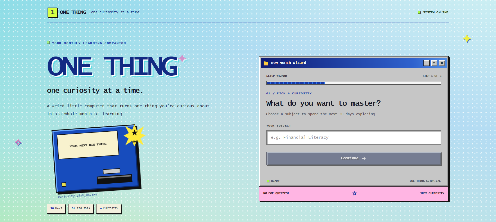

# 🍓 One Thing

### *Master one thing. Make a little magic every month.*

One Thing is a whimsical, AI-powered learning space built around a simple idea:

**You don't need to learn everything. Just pick one thing.**

Every month, choose something you've always wanted to understand — astronomy, cooking, financial literacy, psychology, photography, anything.

Tell One Thing where you're starting and how much time you have.

Then let it build you a little world around it. ☀️

## ✨ What it looks like

  

---

## Week 1 learning setup

Week 1 resources use Tavily Search and require a server-side `TAVILY_API_KEY`
in `.env.local`. Without it, no article links are shown; the topic panel reports
that resource search is not configured. Concise summaries and question answers
use the existing server-side `OPENROUTER_API_KEY`.

Apply `supabase/migrations/20261004120000_week_one_progress.sql` to the Supabase
project before using saved topic progress or notes requests. The migration
creates user-scoped tables with row-level security. Notes requests are stored
only; no email is sent.

## 🌸 The idea

The internet gives us infinite things to learn.

Which is wonderful.

And also... mildly overwhelming.

One Thing turns that endless list of *"I should learn this someday"* into one intentional month 🩵
